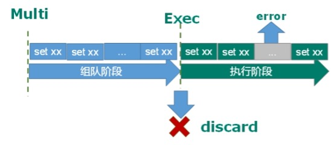

# Redis

## 键操作

|     操作      |                             含义                             |
| :-----------: | :----------------------------------------------------------: |
|    keys *     |                      查看当前库所有key                       |
|  exists key   |                     判断某个key是否存在                      |
|   type key    |                    查看你的key是什么类型                     |
|    del key    |                      删除指定的key数据                       |
|  unlink key   | 根据value选择非阻塞删除,仅将keys从keyspace元数据中删除，真正的删除会在后续异步操作。 |
| expire key 10 |               10秒钟：为给定的key设置过期时间                |
|    ttl key    |       查看还有多少秒过期，-1表示永不过期，-2表示已过期       |
|    select     |                          切换数据库                          |
|    dbsize     |                  查看当前数据库的key的数量                   |
|    flushdb    |                          清空当前库                          |
|   flushall    |                          通杀全部库                          |

## 五大数据类型

### 字符串(String)

String是Redis最基本的类型，一个key对应一个value,可以包含任何数据比如jpg图片或者序列化的对象，一个Redis中字符串value最多可以是512M。

#### 常用命令

|                操作                 |                             意义                             |
| :---------------------------------: | :----------------------------------------------------------: |
|  set  key value [EX\|PX] [NX\|XX]   |                          添加键值对                          |
|                 EX                  |    key的超时秒数second，效果等同于 SETEX key second value    |
|                 PX                  | key的超时毫秒数millisecond，与EX互斥，效果等同于 PSETEX key millisecond value |
|                 NX                  | 当数据库中key不存在时，可以将key-value添加数据库， 效果等同于 SETNX key value 。 |
|                 XX                  | 当数据库中key存在时，可以将key-value添加数据库，与NX参数互斥 |
|              get  key               |                         查询对应键值                         |
|          append key value           |                将给定的value追加到原值的末尾                 |
|             strlen key              |                         获得值的长度                         |
|           setnx key value           |              只有在 key 不存在时  设置 key 的值              |
|              incr key               | 原子操作，将 key 中储存的数字值增1，只能对数字值操作，如果为空，新增值为1 |
|              decr key               | 原子操作，将 key 中储存的数字值减1，只能对数字值操作，如果为空，新增值为-1 |
|      incrby / decrby key 步长       |           将 key 中储存的数字值增减。自定义步长。            |
|  mset key1 value1 key2 value2.....  |                同时设置一个或多个 key-value对                |
|      mget key1 key2 key3.....       |                   同时获取一个或多个 value                   |
| msetnx key1 value1 key2 value2..... | 同时设置一个或多个 key-value 对，当且仅当所有给定 key 都不存在 |
|   getrange key 起始位置 结束位置    |                    获得值的范围，包头包尾                    |
|     setrange key 起始位置 value     | 用 value覆写key所储存的字符串值，从起始位置开始(索引从0开始) |
|      setex key 过期时间 value       |             设置键值的同时，设置过期时间，单位秒             |
|          getset key value           |               以新换旧，设置了新值同时获得旧值               |

#### 数据结构

String的数据结构为简单动态字符串(Simple Dynamic String,缩写SDS)。是可以修改的字符串，内部结构实现上类似于Java的ArrayList，采用预分配冗余空间的方式来减少内存的频繁分配。

如图中所示，内部为当前字符串实际分配的空间capacity一般要高于实际字符串长度len。当字符串长度小于1M时，扩容都是加倍现有的空间，如果超过1M，扩容时一次只会多扩1M的空间。需要注意的是字符串最大长度为512M。

### 列表(List)

单键多值

Redis 列表是简单的字符串列表，按照插入顺序排序。你可以添加一个元素到列表的头部（左边）或者尾部（右边）。

它的底层实际是个双向链表，对两端的操作性能很高，通过索引下标的操作中间的节点性能会较差。

#### 常用命令

|                  操作                   |                      意义                      |
| :-------------------------------------: | :--------------------------------------------: |
| lpush/rpush key value1 value2 value3··· |          从左边/右边插入一个或多个值           |
|              lpop/rpop key              |   从左边/右边吐出一个值，值在键在，值光键亡    |
|           rpoplpush key1 key2           |   从key1列表右边吐出一个值，插到key2列表左边   |
|          lrange key start stop          |         按照索引下标获得元素(从左到右)         |
|           lrange mylist 0 -1            | 0左边第一个，-1右边第一个，（0-1表示获取所有） |
|            lindex key index             |         按照索引下标获得元素(从左到右)         |
|                llen key                 |                  获得列表长度                  |
|   linsert key  before value newvalue    |       在value 的后面插入newvalue 插入值        |
|            lrem key n value             |          从左边删除n个value(从左到右)          |
|           lsetkey index value           |      将列表key下标为index的值替换成value       |

#### 数据结构

List的数据结构为快速链表quickList。

首先在列表元素较少的情况下会使用一块连续的内存存储，这个结构是ziplist，也即是压缩列表。

它将所有的元素紧挨着一起存储，分配的是一块连续的内存。

当数据量比较多的时候才会改成quicklist。

因为普通的链表需要的附加指针空间太大，会比较浪费空间。比如这个列表里存的只是int类型的数据，结构上还需要两个额外的指针prev和next。

Redis将链表和ziplist结合起来组成了quicklist。也就是将多个ziplist使用双向指针串起来使用。这样既满足了快速的插入删除性能，又不会出现太大的空间冗余。

### 集合Set

Redis set对外提供的功能与list类似是一个列表的功能，特殊之处在于set是可以**自动排重**的，当你需要存储一个列表数据，又不希望出现重复数据时，set是一个很好的选择，并且set提供了判断某个成员是否在一个set集合内的重要接口，这个也是list所不能提供的。

Redis的Set是string类型的无序集合。它底层其实是一个value为null的hash表，所以添加，删除，查找的复杂度都是O(1)。

一个算法，随着数据的增加，执行时间的长短，如果是O(1)，数据增加，查找数据的时间不变。

#### 常用命令

|              操作              |                             含义                             |
| :----------------------------: | :----------------------------------------------------------: |
|  sadd key value1 value2.....   | 将一个或多个member 元素加入到集合 key中，已经存在的 member元素将被忽略 |
|          smembers key          |                      取出该集合的所有值                      |
|      sismember key value       |         判断集合key 是否为含有该value 值，有1，没有0         |
|            scardkey            |                     返回该集合的元素个数                     |
|   srem key value1 value2....   |                     删除集合中的某个元素                     |
|            spop key            |                   随机从该集合中吐出一个值                   |
|       srandmember key n        |          随机从该集合中取出n个值。不会从集合中删除           |
| smove source destination value |           把集合中一个值从一个集合移动到另一个集合           |
|        sinter key1 key2        |                    返回两个集合的交集元素                    |
|        sunion key1 key2        |                    返回两个集合的并集元素                    |
|        sdiff key1 key2         |       返回两个集合的差集元素(key1中的，不包含key2中的)       |

#### 数据结构

Set数据结构是dict字典，字典是用哈希表实现的。

Java中HashSet的内部实现使用的是HashMap，只不过所有的value都指向同一个对象。Redis的set结构也是一样，它的内部也使用hash结构，所有的value都指向同一个内部值。

### 哈希(Hash)

Redis hash 是一个键值对集合。

Redis hash是一个string类型的field和value的映射表，hash特别适合用于存储对象，类似Java里面的Map<String,Object>

用户ID为查找的key，存储的value用户对象包含姓名，年龄，生日等信息，如果用普通的key/value结构来存储

#### 常用命令

|                   操作                    |                             含义                             |
| :---------------------------------------: | :----------------------------------------------------------: |
|           hset key field value            |                给key 集合中的field键赋值value                |
|              hget key1 field              |                   从key1集合field取出value                   |
| hmset key1 field1 value1 field2 value2... |                       批量设置hash的值                       |
|             hexistskey1 field             |           查看哈希表 key 中，给定域 field 是否存在           |
|                 hkeys key                 |                  列出该hash集合的所有field                   |
|                 hvals key                 |                  列出该hash集合的所有value                   |
|        hincrby key field increment        |         为哈希表 key 中的域 field 的值加上增量 1  -1         |
|          hsetnx key field value           | 将哈希表 key 中的域 field 的值设置为 value ，当且仅当域 field 不存在 |

#### 数据结构

Hash类型对应的数据结构是两种：ziplist（压缩列表），hashtable（哈希表）。当field-value长度较短且个数较少时，使用ziplist，否则使用hashtable。

### **有序集合Zset(sorted set)** 

Redis有序集合zset与普通集合set非常相似，是一个没有重复元素的字符串集合。

不同之处是有序集合的每个成员都关联了一个**评分(score)**,这个评分（score）被用来按照从最低分到最高分的方式排序集合中的成员。集合的成员是唯一的，但是评分可以是重复了 。

因为元素是有序的, 所以你也可以很快的根据评分（score）或者次序（position）来获取一个范围的元素。

访问有序集合的中间元素也是非常快的,因此你能够使用有序集合作为一个没有重复成员的智能列表。

#### 常用命令

|                             操作                             |                             含义                             |
| :----------------------------------------------------------: | :----------------------------------------------------------: |
|            zadd key score1 value1 score2 value2…             |  将一个或多个 member 元素及其 score 值加入到有序集 key 当中  |
|             zrange key start stop  [WITHSCORES]              | 返回有序集 key 中，下标在start stop之间的元素，带WITHSCORES，可以让分数一起和值返回到结果集 |
| zrange byscore key minmax [withscores] [limit offset count]  | 返回有序集 key 中，所有 score 值介于 min 和 max 之间(包括等于 min 或 max )的成员。有序集成员按 score 值递增(从小到大)次序排列 |
| zrevrange byscore key maxmin [withscores] [limit offset count] |                   同上，改为从大到小排列。                   |
|                 zincrby key increment value                  |                    为元素的score加上增量                     |
|                        zrem key value                        |                  删除该集合下，指定值的元素                  |
|                      zcount key min max                      |               统计该集合，分数区间内的元素个数               |
|                       zrank key value                        |               返回该值在集合中的排名，从0开始                |

如何利用zset实现一个文章访问量的排行榜？

zadd topn 1000 p1 1334 p2 2000 p3

zrevrange topn 0 9 withscores

#### 数据结构

SortedSet(zset)是Redis提供的一个非常特别的数据结构，一方面它等价于Java的数据结构Map<String, Double>，可以给每一个元素value赋予一个权重score，另一方面它又类似于TreeSet，内部的元素会按照权重score进行排序，可以得到每个元素的名次，还可以通过score的范围来获取元素的列表。

zset底层使用了两个数据结构

（1）hash，hash的作用就是关联元素value和权重score，保障元素value的唯一性，可以通过元素value找到相应的score值。

（2）跳跃表，跳跃表的目的在于给元素value排序，根据score的范围获取元素列表。

#### 跳跃表（跳表）

1、简介

  有序集合在生活中比较常见，例如根据成绩对学生排名，根据得分对玩家排名等。对于有序集合的底层实现，可以用数组、平衡树、链表等。数组不便元素的插入、删除；平衡树或红黑树虽然效率高但结构复杂；链表查询需要遍历所有效率低。Redis采用的是跳跃表。跳跃表效率堪比红黑树，实现远比红黑树简单。

2、实例

  对比有序链表和跳跃表，从链表中查询出51

（1） 有序链表

要查找值为51的元素，需要从第一个元素开始依次查找、比较才能找到。共需要6次比较。

（2） 跳跃表

从第2层开始，1节点比51节点小，向后比较。

21节点比51节点小，继续向后比较，后面就是NULL了，所以从21节点向下到第1层

在第1层，41节点比51节点小，继续向后，61节点比51节点大，所以从41向下

在第0层，51节点为要查找的节点，节点被找到，共查找4次。

从此可以看出跳跃表比有序链表效率要高

## Redis新数据类型

### Bitmaps

现代计算机用二进制（位） 作为信息的基础单位， 1个字节等于8位， 例如“abc”字符串是由3个字节组成， 但实际在计算机存储时将其用二进制表示， “abc”分别对应的ASCII码分别是97、 98、 99， 对应的二进制分别是01100001、 01100010和01100011，如下图

合理地使用操作位能够有效地提高内存使用率和开发效率。

​    Redis提供了Bitmaps这个“数据类型”可以实现对位的操作：

1. Bitmaps本身不是一种数据类型， 实际上它就是字符串（key-value） ， 但是它可以对字符串的位进行操作。
2. Bitmaps单独提供了一套命令， 所以在Redis中使用Bitmaps和使用字符串的方法不太相同。 可以把Bitmaps想象成一个以位为单位的数组， 数组的每个单元只能存储0和1， 数组的下标在Bitmaps中叫做偏移量。

##### 命令

1. setbit

   1. 格式

      setbit key offset value 设置Bitmaps中某个偏移量的值（0或1），offset:偏移量从0开始

   2. 实例

      每个独立用户是否访问过网站存放在Bitmaps中， 将访问的用户记做1， 没有访问的用户记做0， 用偏移量作为用户的id。

      设置键的第offset个位的值（从0算起） ， 假设现在有20个用户，userid=1， 6， 11， 15， 19的用户对网站进行了访问， 那么当前Bitmaps初始化结果如图

      

      代表2020-11-06这天的独立访问用户的Bitmaps

      > unique:users:20201106  

      注意：

      很多应用的用户id以一个指定数字（例如10000） 开头， 直接将用户id和Bitmaps的偏移量对应势必会造成一定的浪费， 通常的做法是每次做setbit操作时将用户id减去这个指定数字。

      在第一次初始化Bitmaps时， 假如偏移量非常大， 那么整个初始化过程执行会比较慢， 可能会造成Redis的阻塞。

2. getbit

   1. 格式

      getbit key offset 获取Bitmaps中某个偏移量的值，获取键的第offset位的值（从0开始算）

   2. 实例

      获取id=8的用户是否在2020-11-06这天访问过， 返回0说明没有访问过：

      getbit unique:users:20201106 8

      getbit unique:users:20201106 100

3. bitcount

   统计**字符串**被设置为1的bit数。一般情况下，给定的整个字符串都会被进行计数，通过指定额外的 start 或 end 参数，可以让计数只在特定的位上进行。start 和 end 参数的设置，都可以使用负数值：比如 -1 表示最后一个位，而 -2 表示倒数第二个位，start、end 是指bit组的字节的下标数，二者皆包含。

   1. 格式

      bitcount key [start end] 统计字符串从start字节到end字节比特值为1的数量

   2. 实例

      计算2022-11-06这天的独立访问用户数量

      > bitcount unique:users:20221106

      start和end代表起始和结束字节数， 下面操作计算用户id在第1个字节到第3个字节之间的独立访问用户数， 对应的用户id是11， 15， 19。

      > bitcount unique:users:20221106 1 3

      举例： K1 【01000001 01000000 00000000 00100001】，对应【0，1，2，3】

      bitcount K1 1 2 ： 统计下标1、2字节组中bit=1的个数，即01000000 00000000-->bitcount K1 1 2 -->1

      bitcount K1 1 3 ： 统计下标1、2字节组中bit=1的个数，即01000000 00000000 00100001-->bitcount K1 1 3-->3

      bitcount K1 0 -2 ： 统计下标0到下标倒数第2，字节组中bit=1的个数，即01000001 01000000  00000000-->bitcount K1 0 2-->3

      注意：redis的setbit设置或清除的是bit位置，而bitcount计算的是byte位置。

4. bitop

   1. 格式

      bitop and(or/not/xor)  destkey  [key…]

      bitop是一个复合操作， 它可以做多个Bitmaps的and（交集） 、 or（并集） 、 not（非） 、 xor（异或） 操作并将结果保存在destkey中。

   2. 实例

      2020-11-04 日访问网站的userid=1,2,5,9。

      > setbit unique:users:20201104 1 1
      >
      > setbit unique:users:20201104 2 1
      >
      > setbit unique:users:20201104 5 1
      >
      > setbit unique:users:20201104 9 1

      2020-11-03 日访问网站的userid=0,1,4,9。

      > setbit unique:users:20201103 0 1
      >
      > setbit unique:users:20201103 1 1
      >
      > setbit unique:users:20201103 4 1
      >
      > setbit unique:users:20201103 9 1

      计算出两天都访问过网站的用户数量

      > bitop and unique:users:and:20201104_03
      >
      > unique:users:20201103unique:users:20201104

      

      计算出任意一天都访问过网站的用户数量（例如月活跃就是类似这种） ， 可以使用or求并集

      > bitop or unique:users:or:20201104_03 unique:users:20201103 unique:users:20201104
      >
      > bitcount unique:users:or:20201104_03

### HyperLogLog

在工作当中，我们经常会遇到与统计相关的功能需求，比如统计网站PV（PageView页面访问量）,可以使用Redis的incr、incrby轻松实现。

但像UV（UniqueVisitor，独立访客）、独立IP数、搜索记录数等需要去重和计数的问题如何解决？这种求集合中不重复元素个数的问题称为基数问题。

解决基数问题有很多种方案：

1. 数据存储在MySQL表中，使用distinct count计算不重复个数
2. 使用Redis提供的hash、set、bitmaps等数据结构来处理

以上的方案结果精确，但随着数据不断增加，导致占用空间越来越大，对于非常大的数据集是不切实际的。

能否能够降低一定的精度来平衡存储空间？Redis推出了HyperLogLog

Redis HyperLogLog 是用来做基数统计的算法，HyperLogLog 的优点是，在输入元素的数量或者体积非常非常大时，计算基数所需的空间总是固定的、并且是很小的。

在 Redis 里面，每个 HyperLogLog 键只需要花费 12 KB 内存，就可以计算接近 2^64 个不同元素的基数。这和计算基数时，元素越多耗费内存就越多的集合形成鲜明对比。

但是，因为 HyperLogLog 只会根据输入元素来计算基数，而不会储存输入元素本身，所以 HyperLogLog 不能像集合那样，返回输入的各个元素。

什么是基数?

比如数据集 {1, 3, 5, 7, 5, 7, 8}， 那么这个数据集的基数集为 {1, 3, 5 ,7, 8}, 基数(不重复元素)为5。 基数估计就是在误差可接受的范围内，快速计算基数。

 ##### 命令

1. pfadd

   1. 格式

      pfadd key element  [element ...]  添加指定元素到 HyperLogLog 中

   2. 实例

      > pfadd hil1 "redis"
      >
      > pfadd hil1 "mysql"
      >
      > pfadd hil1 "redis"

      将所有元素添加到指定HyperLogLog数据结构中。如果执行命令后HLL估计的近似基数发生变化，则返回1，否则返回0。

2. pfcount

   1. 格式

      pfcount key [key ...] 计算HLL的近似基数，可以计算多个HLL，比如用HLL存储每天的UV，计算一周的UV可以使用7天的UV合并计算即可

   2. 实例

      > pfcount hll1

3. pfmerge

   1. 格式

      pfmerge destkey sourcekey [sourcekey ...] 将一个或多个HLL合并后的结果存储在另一个HLL中，比如每月活跃用户可以使用每天的活跃用户来合并计算可得

   2. 实例

      > pfcount hll1 hll2
      >
      > pfcount hll3 hll1 hll2
      >
      > pfcount hll3

### Geospatial

Redis 3.2 中增加了对GEO类型的支持。GEO，Geographic，地理信息的缩写。该类型，就是元素的2维坐标，在地图上就是经纬度。redis基于该类型，提供了经纬度设置，查询，范围查询，距离查询，经纬度Hash等常见操作。

#### 命令

1. geoadd

   1. 格式

      1. geoadd key longitude latitude member [longitude latitude member...]  添加地理位置（经度，纬度，名称）

      2. 实例

         > geoadd china:city 121.47 31.23 shanghai
         >
         > geoadd china:city 106.50 29.53 chongqing 114.05 22.52 shenzhen 116.38 39.90 beijing

         两极无法直接添加，一般会下载城市数据，直接通过 Java 程序一次性导入。

         有效的经度从 -180 度到 180 度。有效的纬度从 -85.05112878 度到 85.05112878 度。

         当坐标位置超出指定范围时，该命令将会返回一个错误。

         已经添加的数据，是无法再次往里面添加的。

2. geopos 

   1. 格式

      geopos  key member [member...] 获得指定地区的坐标值

   2. 实例

      > geopos china:city shanghai

3. geodist

   1. 格式

      geodist key member1 member2 [m|km|ft|mi ] 获取两个位置之间的直线距离

   2. 实例

      获取两个位置之间的直线距离

      > geodist china:city beijing Shanghai km

      单位：

      m 表示单位为米[默认值]。

      km 表示单位为千米。

      mi 表示单位为英里。

      ft 表示单位为英尺。

      如果用户没有显式地指定单位参数， 那么 GEODIST 默认使用米作为单位

4. georadius

   1. 格式

      georadius key longitude latitude radius m|km|ft|mi  以给定的经纬度为中心，找出某一半径内的元素,经度 纬度 距离 单位

   2. 实例

      > georadius china:city 110 30 1000 km

## 发布和订阅

#### 什么是发布和订阅

Redis 发布订阅 (pub/sub) 是一种消息通信模式：发送者 (pub) 发送消息，订阅者 (sub) 接收消息。

Redis 客户端可以订阅任意数量的频道。

#### Redis的发布和订阅

1.客户端订阅频道

2、当给这个频道发布消息后，消息就会发送给订阅的客户端

#### 实现

1.一个客户端订阅channel1

subscribe channel1

2.另一台客户端给channel1发送消息,返回订阅者数量

publish channel1 hello

3.第一个客户端可以看到发送的消息

注：发布的消息没有持久化，如果在订阅的客户端收不到消息，只能收到订阅后发布的消息

## Redis事务

Redis事务是一个单独的隔离操作：事务中的所有命令都会序列化、按顺序地执行。事务在执行的过程中，不会被其他客户端发送来的命令请求所打断。

Redis事务的主要作用就是串联多个命令防止别的命令插队。

#### Multi、Exec、discard

从输入Multi命令开始，输入的命令都会依次进入命令队列中，但不会执行，直到输入Exec后，Redis会将之前的命令队列中的命令依次执行。

组队的过程中可以通过discard来放弃组

组队成功，提交成功。

组队阶段报错，提交失败。

组队成功，提交有成功有失败。

#### 事务的错误处理

组队中某个命令出现了报告错误，执行时整个的所有队列都会被取消

如果执行阶段某个命令报出了错误，则只有报错的命令不会被执行，而其他的命令都会执行，不会回滚。

#### 悲观锁

**悲观锁(Pessimistic Lock)**, 顾名思义，就是很悲观，每次去拿数据的时候都认为别人会修改，所以每次在拿数据的时候都会上锁，这样别人想拿这个数据就会block直到它拿到锁。**传统的关系型数据库里边就用到了很多这种锁机制**，比如**行锁**，**表锁**等，**读锁**，**写锁**等，都是在做操作之前先上锁。

#### 乐观锁

**乐观锁(Optimistic Lock),** 顾名思义，就是很乐观，每次去拿数据的时候都认为别人不会修改，所以不会上锁，但是在更新的时候会判断一下在此期间别人有没有去更新这个数据，可以使用版本号等机制。**乐观锁适用于多读的应用类型，这样可以提高吞吐量**。Redis就是利用这种check-and-set机制实现事务的。

#### WATCH **key** [key ...]

在执行multi之前，先执行watch key1 [key2],可以监视一个(或多个) key ，如果在**事务执行之前这个(或这些) key 被其他命令所改动，那么事务将被中断。**

#### unwatch

取消 WATCH 命令对所有 key 的监视。

如果在执行 WATCH 命令之后，EXEC 命令或DISCARD 命令先被执行了的话，那么就不需要再执行UNWATCH 了。

#### 事务的三特性

1.单独的隔离操作 

事务中的所有命令都会序列化、按顺序地执行。事务在执行的过程中，不会被其他客户端发送来的命令请求所打断。 

2.没有隔离级别的概念 

队列中的命令没有提交之前都不会实际被执行，因为事务提交前任何指令都不会被实际执行

不保证原子性 

3.事务中如果有一条命令执行失败，其后的命令仍然会被执行，没有回滚 

## Redis持久化

### RDB（Redis DataBase）

在指定的时间间隔内将内存中的数据集快照写入磁盘， 也就是行话讲的Snapshot快照，它恢复时是将快照文件直接读到内存里。

#### 备份如何执行

Redis会单独创建（fork）一个子进程来进行持久化，会先将数据写入到 一个临时文件中，待持久化过程都结束了，再用这个临时文件替换上次持久化好的文件。 整个过程中，主进程是不进行任何IO操作的，这就确保了极高的性能 如果需要进行大规模数据的恢复，且对于数据恢复的完整性不是非常敏感，那RDB方式要比AOF方式更加的高效。**RDB的缺点是最后一次持久化后的数据可能丢失。**

#### Fork

- Fork的作用是复制一个与当前进程一样的进程。新进程的所有数据（变量、环境变量、程序计数器等） 数值都和原进程一致，但是是一个全新的进程，并作为原进程的子进程
- 在Linux程序中，fork()会产生一个和父进程完全相同的子进程，但子进程在此后多会exec系统调用，出于效率考虑，Linux中引入了“**写时复制技术**”
- **一般情况父进程和子进程会共用同一段物理内存**，只有进程空间的各段的内容要发生变化时，才会将父进程的内容复制一份给子进程。

#### redis.conf关于RDF核心的配置及命令

##### 配置文件名称dbfilename

在redis.conf中配置文件名称，默认为dump.rdb

##### 配置文件位置dir

rdb文件的保存路径，默认为Redis启动时命令行所在的目录下。也可以修改，比如dir "/myredis/"

##### save

格式：save 秒钟 写操作次数

RDB是整个内存的压缩过的Snapshot，RDB的数据结构，可以配置复合的快照触发条件，

**默认是1分钟内改了1万次，或5分钟内改了100次，或60分钟内改了1次。**

禁用:给save传入空字符串

##### 命令save VS bgsave

save ：save时只管保存，其它不管，全部阻塞。手动保存。不建议。

bgsave：Redis会在后台异步进行快照操作，快照同时还可以响应客户端请求。可以通过lastsave 命令获取最后一次成功执行快照的时间。

##### flushall命令

执行flushall命令，也会产生dump.rdb文件，但里面是空的，无意义

#### redis.conf关于RDF更多的配置

##### stop-writes-on-bgsave-error

当Redis无法写入磁盘的话，直接关掉Redis的写操作。推荐yes.

##### rdbcompression压缩文件

对于存储到磁盘中的快照，可以设置是否进行压缩存储。如果是的话，redis会采用LZF算法进行压缩。

如果你不想消耗CPU来进行压缩的话，可以设置为关闭此功能。推荐yes.

##### rdbchecksum检查完整性

在存储快照后，还可以让redis使用CRC64算法来进行数据校验，

但是这样做会增加大约10%的性能消耗，如果希望获取到最大的性能提升，可以关闭此功能。推荐yes.

#### rdb的备份

先通过config get dir 查询rdb文件的目录 

将*.rdb的文件拷贝到别的地方

rdb的恢复

1. 关闭Redis
2. 先把备份的文件拷贝到工作目录下 cp dump2.rdb dump.rdb
3. 启动Redis, 备份数据会直接加载

#### 优势

- 适合大规模的数据恢复
- 对数据完整性和一致性要求不高更适合使用
- 节省磁盘空间
- 恢复速度快

#### 劣势

- Fork的时候，内存中的数据被克隆了一份，大致2倍的膨胀性需要考虑
- 虽然Redis在fork时使用了**写时拷贝技术**,但是如果数据庞大时还是比较消耗性能。
- 在备份周期在一定间隔时间做一次备份，所以如果Redis意外down掉的话，就会丢失最后一次快照后的所有修改。

#### 如何停止

停止RDB：redis-cli config set save ""#save后给空值，表示禁用保存策略

#### 总结

### AOF（Append Of File）

以日志的形式来记录每个写操作（增量保存），将Redis执行过的所有写指令记录下来(读操作不记录**)， **只许追加文件但不可以改写文件，redis启动之初会读取该文件重新构建数据，换言之，redis 重启的话就根据日志文件的内容将写指令从前到后执行一次以完成数据的恢复工作

#### AOF默认不开启

在redis.conf中有选项appendonly no，含义是不开启AOF。可以设置为appendonly yes，代表开启AOF。

AOF和RDB同时开启，系统默认取AOF的数据（数据不会存在丢失）

可以在redis.conf中通过appendfilename配置文件名称，默认为 appendonly.aof。AOF文件的保存路径，同RDB的路径一致。

#### AOF持久化流程

1. 客户端的请求写命令会被append追加到AOF缓冲区内；
2. AOF缓冲区根据AOF持久化策略[always,everysec,no]将操作sync同步到磁盘的AOF文件中；
3. AOF文件大小超过重写策略或手动重写时，会对AOF文件rewrite重写，压缩AOF文件容量；
4. Redis服务重启时，会重新load加载AOF文件中的写操作达到数据恢复的目的；

#### AOF同步频率设置

appendfsync always

始终同步，每次Redis的写入都会立刻记入日志；性能较差但数据完整性比较好

appendfsync everysec

每秒同步，每秒记入日志一次，如果宕机，本秒的数据可能丢失。

appendfsync no

redis不主动进行同步，把同步时机交给操作系统。

#### Rewrite压缩

1. 是什么：

   AOF采用文件追加方式，文件会越来越大为避免出现此种情况，新增了重写机制, 当AOF文件的大小超过所设定的阈值时，Redis就会启动AOF文件的内容压缩， 只保留可以恢复数据的最小指令集.可以使用命令bgrewriteaof

2. 重写原理，如何实现重写

   AOF文件持续增长而过大时，会fork出一条新进程来将文件重写(也是先写临时文件最后再rename)，redis4.0版本后的重写，是指上就是把rdb 的快照，以二级制的形式附在新的aof头部，作为已有的历史数据，替换掉原来的流水账操作。

   > no-appendfsync-on-rewrite：

   如果 no-appendfsync-on-rewrite=yes ,不写入aof文件只写入缓存，用户请求不会阻塞，但是在这段时间如果宕机会丢失这段时间的缓存数据。（降低数据安全性，提高性能）

   如果 no-appendfsync-on-rewrite=no, 还是会把数据往磁盘里刷，但是遇到重写操作，可能会发生阻塞。（数据安全，但是性能降低）

   > 触发机制，何时重写

   Redis会记录上次重写时的AOF大小，默认配置是当AOF文件大小是上次rewrite后大小的一倍且文件大于64M时触发重写虽然可以节约大量磁盘空间，减少恢复时间。但是每次重写还是有一定的负担的，因此设定Redis要满足一定条件才会进行重写。 

   > auto-aof-rewrite-percentage：

   设置重写的基准值，文件达到100%时开始重写（文件是原来重写后文件的2倍时触发）

   > auto-aof-rewrite-min-size：设置重写的基准值，最小文件64MB。达到这个值开始重写。

   例如：文件达到70MB开始重写，降到50MB，下次什么时候开始重写？100MB

   系统载入时或者上次重写完毕时，Redis会记录此时AOF大小，设为base_size,

   如果Redis的AOF当前大小>= base_size +base_size*100% (默认)且当前大小>=64mb(默认)的情况下，Redis会对AOF进行重写。 

3. 重写流程

   1. bgrewriteaof触发重写，判断是否当前有bgsave或bgrewriteaof在运行，如果有，则等待该命令结束后再继续执行。
   2. 主进程fork出子进程执行重写操作，保证主进程不会阻塞。
   3. 子进程遍历redis内存中数据到临时文件，客户端的写请求同时写入aof_buf缓冲区和aof_rewrite_buf重写缓冲区保证原AOF文件完整以及新AOF文件生成期间的新的数据修改动作不会丢失。
   4. 子进程写完新的AOF文件后，向主进程发信号，父进程更新统计信息。2).主进程把aof_rewrite_buf中的数据写入到新的AOF文件。
   5. 使用新的AOF文件覆盖旧的AOF文件，完成AOF重写。

#### AOF启动/修复/恢复

- AOF的备份机制和性能虽然和RDB不同, 但是备份和恢复的操作同RDB一样，都是拷贝备份文件，需要恢复时再拷贝到Redis工作目录下，启动系统即加载。
- 正常恢复
  -  修改默认的appendonly no，改为yes
  - 将有数据的aof文件复制一份保存到对应目录(查看目录：config get dir)
  - 恢复：重启redis然后重新加载
- 异常恢复
  - 修改默认的appendonly no，改为yes
  - 如遇到**AOF****文件损坏**，通过/usr/local/bin/**redis-check-aof--fix appendonly.aof**进行恢复
  - 备份被写坏的AOF文件
  - 恢复：重启redis，然后重新加载

#### 优势

- 备份机制更稳健，丢失数据概率更低。
- 可读的日志文本，通过操作AOF稳健，可以处理误操作。

#### 劣势

- 比起RDB占用更多的磁盘空间。
- 恢复备份速度要慢。
- 每次读写都同步的话，有一定的性能压力。
- 存在个别Bug，造成恢复不能。

#### 小总结

### 哪个好用

官方推荐两个都启用。

如果对数据不敏感，可以选单独用RDB。

不建议单独用 AOF，因为可能会出现Bug。

如果只是做纯内存缓存，可以都不用。

## Redis应用问题解决

### 缓存穿透

key对应的数据在数据源并不存在，每次针对此key的请求从缓存获取不到，请求都会压到数据源，从而可能压垮数据源。比如用一个不存在的用户id获取用户信息，不论缓存还是数据库都没有，若黑客利用此漏洞进行攻击可能压垮数据库。

#### 解决方案

一个一定不存在缓存及查询不到的数据，由于缓存是不命中时被动写的，并且出于容错考虑，如果从存储层查不到数据则不写入缓存，这将导致这个不存在的数据每次请求都要到存储层去查询，失去了缓存的意义。

1. **对空值缓存：**如果一个查询返回的数据为空（不管是数据是否不存在），我们仍然把这个空结果（null）进行缓存，设置空结果的过期时间会很短，最长不超过五分钟
2. **设置可访问的名单（白名单）：**使用bitmaps类型定义一个可以访问的名单，名单id作为bitmaps的偏移量，每次访问和bitmap里面的id进行比较，如果访问id不在bitmaps里面，进行拦截，不允许访问。
3. **采用布隆过滤器**：(布隆过滤器（Bloom Filter）是1970年由布隆提出的。它实际上是一个很长的二进制向量(位图)和一系列随机映射函数（哈希函数）。布隆过滤器可以用于检索一个元素是否在一个集合中。它的优点是空间效率和查询时间都远远超过一般的算法，缺点是有一定的误识别率和删除困难。)将所有可能存在的数据哈希到一个足够大的bitmaps中，一个一定不存在的数据会被 这个bitmaps拦截掉，从而避免了对底层存储系统的查询压力。
4. **进行实时监控**：当发现Redis的命中率开始急速降低，需要排查访问对象和访问的数据，和运维人员配合，可以设置黑名单限制服务

### 缓存击穿

key对应的数据存在，但在redis中过期，此时若有大量并发请求过来，这些请求发现缓存过期一般都会从后端DB加载数据并回设到缓存，这个时候大并发的请求可能会瞬间把后端DB压垮。

#### 解决方案

key可能会在某些时间点被超高并发地访问，是一种非常“热点”的数据。这个时候，需要考虑一个问题：缓存被“击穿”的问题。

1. **预先设置热门数据**：在redis高峰访问之前，把一些热门数据提前存入到redis里面，加大这些热门数据key的时长
2. **实时调整**：现场监控哪些数据热门，实时调整key的过期时长
3. **使用锁**：
   1. 就是在缓存失效的时候（判断拿出来的值为空），不是立即去load db。
   2. 先使用缓存工具的某些带成功操作返回值的操作（比如Redis的SETNX）去set一个mutex key
   3. 当操作返回成功时，再进行load db的操作，并回设缓存,最后删除mutex key；
   4. 当操作返回失败，证明有线程在load db，当前线程睡眠一段时间再重试整个get缓存的方法。

### 缓存雪崩

key对应的数据存在，但在redis中过期，此时若有大量并发请求过来，这些请求发现缓存过期一般都会从后端DB加载数据并回设到缓存，这个时候大并发的请求可能会瞬间把后端DB压垮。缓存雪崩与缓存击穿的区别在于这里针对很多key缓存，前者则是某一个key

正产访问：

缓存失效瞬间：

 

#### 解决方案

缓存失效时的雪崩效应对底层系统的冲击非常可怕！

1. **构建多级缓存架构：**nginx缓存 + redis缓存 +其他缓存（ehcache等）
2. **使用锁或队列：**用加锁或者队列的方式保证来保证不会有大量的线程对数据库一次性进行读写，从而避免失效时大量的并发请求落到底层存储系统上。不适用高并发情况
3. **设置过期标志更新缓存：**记录缓存数据是否过期（设置提前量），如果过期会触发通知另外的线程在后台去更新实际key的缓存。
4. **将缓存失效时间分散开：**比如我们可以在原有的失效时间基础上增加一个随机值，比如1-5分钟随机，这样每一个缓存的过期时间的重复率就会降低，就很难引发集体失效的事件。

### 分布式锁

随着业务发展的需要，原单体单机部署的系统被演化成分布式集群系统后，由于分布式系统多线程、多进程并且分布在不同机器上，这将使原单机部署情况下的并发控制锁策略失效，单纯的Java API并不能提供分布式锁的能力。为了解决这个问题就需要一种跨JVM的互斥机制来控制共享资源的访问，这就是分布式锁要解决的问题！

分布式锁主流的实现方案：

1. 基于数据库实现分布式锁
2. 基于缓存（Redis等）
3. 基于Zookeeper

每一种分布式锁解决方案都有各自的优缺点：

1. 性能：redis最高
2. 可靠性：zookeeper最高

这里，我们就基于redis实现分布式锁。

#### 使用redis实现分布式锁

需要用到先前的String命令：[点击跳转](#jump)

EX,PX,EX,XX

1. 多个客户端同时获取锁（setnx）
2. 获取成功，执行业务逻辑{从db获取数据，放入缓存}，执行完成释放锁（del）
3. 其他客户端等待重试

~~~java
@GetMapping("testLock")
public void testLock() throws InterruptedException {
    //1获取锁，setne
    Boolean lock = redisTemplate.opsForValue().setIfAbsent("lock", "111");
    //2获取锁成功、查询num的值
    if(lock){
        Object value = redisTemplate.opsForValue().get("num");
        //2.1判断num为空return
        if(StringUtils.isEmpty(value)){
            return;
        }
        //2.2有值就转成成int
        int num = Integer.parseInt(value+"");
        //2.3把redis的num加1
        redisTemplate.opsForValue().set("num", ++num);
        //2.4 模拟处理业务需要花费2秒，
        Thread.sleep(2000);
        //2.5 释放锁，del
        redisTemplate.delete("lock");

    }else{
      	// 自旋
        //3获取锁失败、每隔0.1秒再获取
        try {
            Thread.sleep(100);
            testLock();
        } catch (InterruptedException e) {
            e.printStackTrace();
        }
    }
}
~~~

问题：setnx刚好获取到锁，业务逻辑出现异常，导致锁无法释放

解决：设置过期时间，自动释放锁。

#### 优化之设置锁的过期时间

就是允许业务执行时间最长为过期时间，如果过期了还没有执行完就认为业务执行中出现了问题。

设置过期时间有两种方式：

1. 首先想到通过expire设置过期时间（缺乏原子性：如果在setnx和expire之间出现异常，锁也无法释放）
2. 在set时指定过期时间（推荐）

~~~java
// 原子设置过期时间为3秒
Boolean lock = redisTemplate.opsForValue().setIfAbsent("lock", "111",3, TimeUnit.SECONDS);
~~~

问题：可能会释放其他服务器的锁。

场景：如果业务逻辑的执行时间是7s。执行流程如下

1. index1业务逻辑没执行完，3秒后锁被自动释放。
2. index2获取到锁，执行业务逻辑，3秒后锁被自动释放。
3. index3获取到锁，执行业务逻辑
4. index1业务逻辑执行完成，开始调用del释放锁，这时释放的是index3的锁，导致index3的业务只执行1s就被别人释放。

最终等于没锁的情况。

解决：setnx获取锁时，设置一个指定的唯一值（例如：uuid）；释放前获取这个值，判断是否自己的锁

#### 优化之UUID防误删

~~~java
//1获取锁，setne
UUID uuid = UUID.randomUUID();
Boolean lock = redisTemplate.opsForValue().setIfAbsent("lock", uuid,3, TimeUnit.SECONDS);
//2.5 释放锁之前判断一下是不是自己的锁
if (uuid.equals(redisTemplate.opsForValue().get("lock"))) {
		this.redisTemplate.delete("lock");
}
~~~

问题：删除操作缺乏原子性。

场景：

1. index1执行删除时，查询到的lock值确实和uuid相等

   uuid=v1

   set(lock,uuid)；

2. index1执行删除前，lock刚好过期时间已到，被redis自动释放

   在redis中没有了lock，没有了锁。

3. index2获取了lock

   index2线程获取到了cpu的资源，开始执行方法

   uuid=v2

   set(lock,uuid)；

4. index1执行删除，此时会把index2的lock删除

   index1 因为已经在方法中了，所以不需要重新上锁。index1有执行的权限。index1已经比较完成了，这个时候，开始执行

   删除的index2的锁！

#### 优化之LUA脚本保证删除的原子性

~~~java
@GetMapping("testLockLua")
public void testLockLua() {
    //1 声明一个uuid ,将做为一个value 放入我们的key所对应的值中
    String uuid = UUID.randomUUID().toString();
    //2 定义一个锁：lua 脚本可以使用同一把锁，来实现删除！
  	
    String skuId = "25"; // 访问skuId 为25号的商品 100008348542
  	// 定义key，key应该是为每个sku定义的，也就是每个sku有一把锁，锁住的是每个商品的数据
    String locKey = "lock:" + skuId;

    // 3 获取锁
    Boolean lock = redisTemplate.opsForValue().setIfAbsent(locKey, uuid, 3, TimeUnit.SECONDS);

    // 第一种： lock 与过期时间中间不写任何的代码。
    // redisTemplate.expire("lock",10, TimeUnit.SECONDS);//设置过期时间
    // 如果true
    if (lock) {
        // 执行的业务逻辑开始
        // 获取缓存中的num 数据
        Object value = redisTemplate.opsForValue().get("num");
        // 如果是空直接返回
        if (StringUtils.isEmpty(value)) {
            return;
        }
        // 不是空 如果说在这出现了异常！ 那么delete 就删除失败！ 也就是说锁永远存在！
        int num = Integer.parseInt(value + "");
        // 使num 每次+1 放入缓存
        redisTemplate.opsForValue().set("num", String.valueOf(++num));
        /*使用lua脚本来锁*/
        // 定义lua 脚本
        String script = "if redis.call('get', KEYS[1]) == ARGV[1] then return redis.call('del', KEYS[1]) else return 0 end";
        // 使用redis执行lua执行
        DefaultRedisScript<Long> redisScript = new DefaultRedisScript<>();
        redisScript.setScriptText(script);
        // 设置一下返回值类型 为Long
        // 因为删除判断的时候，返回的0,给其封装为数据类型。如果不封装那么默认返回String 类型，
        // 那么返回字符串与0 会有发生错误。
        redisScript.setResultType(Long.class);
        // 第一个要是script 脚本 ，第二个需要判断的key，第三个就是key所对应的值。
        redisTemplate.execute(redisScript, Arrays.asList(locKey), uuid);
    } else {
        // 其他线程等待
        try {
            // 睡眠
            Thread.sleep(1000);
            // 睡醒了之后，调用方法。
            testLockLua();
        } catch (InterruptedException e) {
            e.printStackTrace();
        }
    }
}
~~~

##### Lua脚本详解 TODO

#### 总结

1. 加锁
2. 使用lua释放锁
3. 重试

为了确保分布式锁可用，我们至少要确保锁的实现同时**满足以下四个条件**：

- 互斥性。在任意时刻，只有一个客户端能持有锁。
- 不会发生死锁。即使有一个客户端在持有锁的期间崩溃而没有主动解锁，也能保证后续其他客户端能加锁。
- 解铃还须系铃人。加锁和解锁必须是同一个客户端，客户端自己不能把别人加的锁给解了。
- 加锁和解锁必须具有原子性。

## Redis6新特性

### ACL

Redis ACL是Access Control List（访问控制列表）的缩写，该功能允许根据可以执行的命令和可以访问的键来限制某些连接。

在Redis 5版本之前，Redis 安全规则只有密码控制 还有通过rename 来调整高危命令比如 flushdb ， KEYS* ， shutdown 等。Redis 6 则提供ACL的功能对用户进行更细粒度的权限控制 ：

- 接入权限:用户名和密码 
- 可以执行的命令 
- 可以操作的 KEY

参考官网：https://redis.io/topics/acl

#### 命令

1. 使用acl list命令展现用户权限列表

   

2. 使用acl cat命令

   查看添加权限指令的类别，eg：read，write，string....

   加参数类型名可以查看类型下具体命令acl cat string,eg:get,decr,substr...

3. 使用acl whoami命令查看当前用户

4. 使用aclsetuser命令创建和编辑用户ACL

