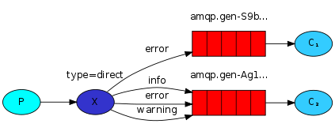

# RabbitMQ

## 介绍

RabbitMQ构架图


Broker：接收和分发消息的应用，RabbitMQ Server就是 Message Broker

Virtual host:出于多租户和安全因素设计的，把 AMQP 的基本组件划分到一个虚拟的分组中，类似于网络中的 namespace 概念。当多个不同的用户使用同一个 RabbitMQ server 提供的服务时，可以划分出多个vhost，每个用户在自己的 vhost 创建 exchange／queue 等

**Connection**：publisher／consumer 和 broker 之间的 TCP 连接

**Channel**：如果每一次访问 RabbitMQ 都建立一个 Connection，在消息量大的时候建立 TCP Connection的开销将是巨大的，效率也较低。Channel 是在 connection 内部建立的逻辑连接，如果应用程序支持多线程，通常每个thread创建单独的 channel 进行通讯，AMQP method 包含了channel id 帮助客户端和message broker 识别 channel，所以 channel 之间是完全隔离的。Channel 作为轻量级的 Connection 极大减少了操作系统建立 TCP connection 的开销

**Exchange**：message 到达 broker 的第一站，根据分发规则，匹配查询表中的 routing key，分发消息到queue 中去。常用的类型有：**direct (point-to-point)**， **topic (publish-subscribe)** and **fanout (multicast)**

**Queue**：存储消息的容器，消息最终被送到这里，等待 consumer 取走

**Binding**：exchange 和 queue 之间的虚拟连接，binding 中可以包含 routing key。Binding 信息被保存到 exchange 中的查询表中，用于 message 的分发依据

## HelloWorld

导入amqp-client的依赖：

```
<dependencies>
        <dependency>
            <groupId>com.rabbitmq</groupId>
            <artifactId>amqp-client</artifactId>
            <version>5.6.0</version>
        </dependency>
    </dependencies>
```

生产者：

```java
public class Producer {
 
    public static void main(String[] args) throws Exception {
        //创建连接工厂
        ConnectionFactory connectionFactory = new ConnectionFactory();
        //主机地址
        connectionFactory.setHost("192.168.6.100");
        //连接端口，默认为 5672
        //connectionFactory.setPort(5672);
        //虚拟主机名称，默认为 /
        //connectionFactory.setVirtualHost("/");
        //连接用户名；默认为guest
        connectionFactory.setUsername("admin");
        //连接密码；默认为guest
        connectionFactory.setPassword("123456");
      
        //创建连接
      	//创建频道
      	try(Connection connection = connectionFactory.newConnection();
           Channel channel = connection.createChannel()) {
          	// 声明（创建）队列
        		/**
         		* queue      参数1：队列名称
         		* durable    参数2：是否定义持久化队列,当mq重启之后,还在
         		* exclusive  参数3：是否独占本次连接，只供一个消费者消费，true可以多个消费者消费
         		* autoDelete 参数4：是否在不使用的时候自动删除队列,当没有consumer时,自动删除
         		* arguments  参数5：队列其它参数
         		* 如果没有一个名字叫simple_queue的队列,则会创建该队列,如果有则不会创建
         		*/
        		channel.queueDeclare("simple_queue", true, false, false, null);
 
        		// 要发送的信息
        		String message = "你好；小兔子！";
        		/**
        		 * 参数1：交换机名称,如果没有指定则使用默认Default Exchage
        		 * 参数2：路由key,队列绑定路由key值后传入路由key，没有传入队列名
        		 * 参数3：配置信息
        		 * 参数4：消息内容
        		 */
        		channel.basicPublish("", "simple_queue", null, message.getBytes());
        		System.out.println("已发送消息：" + message);
        }
    }
}
```

消费者：

```java
public class Consumer {
    public static void main(String[] args) throws Exception {
        // 创建连接工厂
        ConnectionFactory factory = new ConnectionFactory();
        // 设置参数
        factory.setHost("192.168.6.100");//ip
        factory.setUsername("admin");//用户名
        factory.setPassword("123456");//密码
        // 创建连接 Connection
        Connection connection = factory.newConnection();
        // 创建Channel
        Channel channel = connection.createChannel();
 
        //消息接受
        DeliverCallback deliverCallback = (consumerTag, delivery) -> {
            String receivedMessage = new String(delivery.getBody());
            System.out.println("接收到消息:" + receivedMessage);
        };
        //消息被取消
        CancelCallback cancelCallback = (consumerTag) -> {
            System.out.println(consumerTag + "消费者取消消费接口回调逻辑");
        };
        /*
        basicConsume(String queue, boolean autoAck, Consumer callback)
        参数：
            1. queue：队列名称
            2. autoAck：是否自动确认 ,类似咱们发短信,发送成功会收到一个确认消息
            3. callback：回调对象
         */
        // 消费者类似一个监听程序,主要是用来监听消息
        channel.basicConsume("simple_queue",true,deliverCallback,cancelCallback);
   }
}
```

## AMQP

AMQP 一个提供统一消息服务的应用层标准高级消息队列协议，是应用层协议的一个开放标准，为面向消息的中间件设计。

| **概念**       | **说明**                                                     |
| -------------- | ------------------------------------------------------------ |
| 连接Connection | 一个网络连接，比如TCP/IP套接字连接。                         |
| 信道Channel    | 多路复用连接中的一条独立的双向数据流通道。为会话提供物理传输介质。 |
| 客户端Client   | AMQP连接或者会话的发起者。AMQP是非对称的，客户端生产和消费消息，服务器存储和路由这些消息。 |
| 服务节点Broker | 消息中间件的服务节点；一般情况下可以将一个RabbitMQ  Broker看作一台RabbitMQ 服务器。 |
| 端点           | AMQP对话的任意一方。一个AMQP连接包括两个端点（一个是客户端，一个是服务器）。 |
| 消费者Consumer | 一个从消息队列里请求消息的客户端程序。                       |
| 生产者Producer | 一个向交换机发布消息的客户端应用程序。                       |

### RabbitMQ运转流程

- 生产者发送消息

1. 生产者创建连接（Connection），开启一个信道（Channel），连接到RabbitMQ Broker；
2. 声明队列并设置属性，如是否排它，是否持久化，是否自动删除；
3. 将通道和路由器进行绑定，同时可以指定路由key，也可以不设置使用默认路由器
4. 发送消息至RabbitMQ Broker，指定到达的路由器和规则key
5. 关闭信道；
6. 关闭连接；

- 消费者接收消息

1. 消费者创建连接（Connection），开启一个信道（Channel），连接到RabbitMQ Broker
2. 向Broker 请求消费相应队列中的消息，设置相应的回调函数；
3. 等待Broker投递响应队列中的消息，消费者接收消息；
4. 确认（ack，自动确认）接收到的消息；
5. RabbitMQ从队列中删除相应已经被确认的消息；
6. 关闭信道；
7. 关闭连接；

## RabbitMQ工作模式

### Work queues工作队列模式


Work Queues与入门程序的简单模式相比，使用了多个消费端共同消费同一个队列中的消息。

**应用场景**：对于任务过重或任务较多情况使用工作队列可以提高任务处理的速度。

从这里开始对工具类进行抽取：

```java
public class RabbitMqUtils {
    //得到一个Connection
    public static Channel getChannel() throws Exception {
        //创建一个连接工厂
        ConnectionFactory factory = new ConnectionFactory();
        factory.setHost("192.168.6.100");
        factory.setUsername("root");
        factory.setPassword("root");
      	Connection connection = factory.newConnection();
      	Channel channel = connection.createChannerl();
        return channel;
    }
}
```

生产者

```java
public class Producer {
    static final String QUEUE_NAME = "work_queue";
    public static void main(String[] args) throws Exception {
      	try(Channel channel = RabbitMqUtils.getChannel();){
        		channel.queueDeclare(QUEUE_NAME,true,false,false,null);
        		for (int i = 1; i <= 10; i++) {
            		String body = i+"hello rabbitmq";
          			// 默认交换机，
            		channel.basicPublish("",QUEUE_NAME,null,body.getBytes());
        		}
        }
    }
```

启动两个消费者

```java
public class Consumer1 {
    static final String QUEUE_NAME = "work_queue";
    public static void main(String[] args) throws Exception {
        Channel channel = RabbitMqUtils.getChannel();
      	
        //消息接受
        DeliverCallback deliverCallback = (consumerTag, delivery) -> {
            String receivedMessage = new String(delivery.getBody());
            System.out.println("接收到消息:" + receivedMessage);
        };
        //消息被取消
        CancelCallback cancelCallback = (consumerTag) -> {
            System.out.println(consumerTag + "消费者取消消费接口回调逻辑");
        };
        				channel.basicConsume(QUEUE_NAME,true,consumer,deliverCallback,cancelCallback);
    }
}
```

### Publish/Subscribe发布订阅模式


生产者只是创建一个交换机，向交换机中传入数据，需要消费者创建队列绑定交换机，由于交换机不存储数据，如果消费者没有运行，数据会丢失。

前面2个案例中，只有3个角色：

- P：生产者，也就是要发送消息的程序
- C：消费者：消息的接受者，会一直等待消息到来。
- queue：消息队列，图中红色部分

而在订阅模型中，多了一个exchange角色，而且过程略有变化：

- P：生产者，也就是要发送消息的程序，但是不再发送到队列中，而是发给X（交换机）
- C：消费者，消息的接受者，会一直等待消息到来。
- Queue：消息队列，接收消息、缓存消息。
- Exchange：交换机，图中的X。一方面，接收生产者发送的消息。另一方面，知道如何处理消息，例如递交给某个特别队列、递交给所有队列、或是将消息丢弃。到底如何操作，取决于Exchange的类型。Exchange有常见以下3种类型：
  - Fanout：广播，将消息交给所有绑定到交换机的队列
  - Direct：定向，把消息交给符合指定routing key 的队列
  - Topic：通配符，把消息交给符合routing pattern（路由模式） 的队列


Exchange（交换机）只负责转发消息，不具备存储消息的能力，因此如果没有任何队列与Exchange绑定，或者没有符合路由规则的队列，那么消息会丢失！

生产者

```java
public class EmitLog {

    private static final String EXCHANGE_NAME = "logs";

    public static void main(String[] args) throws Exception {
        Connection connection = ConnectionUtil.getConnection();
        Channel channel = connection.createChannel();
        channel.exchangeDeclare(EXCHANGE_NAME, "fanout");

        String message = "hello world";

        channel.basicPublish(EXCHANGE_NAME, "", null, message.getBytes("UTF-8"));
        System.out.println("发送端发送" + message + "'");
      	channel.close();
        connection.close();
    }
}
```

消费者

```java
public class ReceiveLog1 {

    private static final String EXCHANGE_NAME = "logs";

    public static void main(String[] args) throws Exception {
        Connection connection = ConnectionUtil.getConnection();
        Channel channel = connection.createChannel();
        channel.exchangeDeclare(EXCHANGE_NAME, "fanout");
    		String queueName = channel.queueDeclare().getQueue();
    		channel.queueBind(queueName, EXCHANGE_NAME, "");

    		DeliverCallback deliverCallback = (consumerTag, delivery) -> {
    		    String message = new String(delivery.getBody(), "UTF-8");
    		    System.out.println("消费者1收到消息" + message);
    		};
    		channel.basicConsume(queueName, true, deliverCallback, consumerTag -> { });
      	channel.close();
        connection.close();
    }
}

public class ReceiveLog2 {

    private static final String EXCHANGE_NAME = "logs";

    public static void main(String[] args) throws Exception {
        Connection connection = ConnectionUtil.getConnection();
        Channel channel = connection.createChannel();
        channel.exchangeDeclare(EXCHANGE_NAME, "fanout");
    		String queueName = channel.queueDeclare().getQueue();
    		channel.queueBind(queueName, EXCHANGE_NAME, "");

    		DeliverCallback deliverCallback = (consumerTag, delivery) -> {
    		    String message = new String(delivery.getBody(), "UTF-8");
    		    System.out.println("消费者2收到消息" + message);
    		};
    		channel.basicConsume(queueName, true, deliverCallback, consumerTag -> { });
      	channel.close();
        connection.close();
    }
}
```

### Routing路由模式

路由模式特点：

- 队列与交换机的绑定，不能是任意绑定了，而是要指定一个`RoutingKey`（路由key）
- 消息的发送方在 向 Exchange发送消息时，也必须指定消息的 `RoutingKey`。
- Exchange不再把消息交给每一个绑定的队列，而是根据消息的`Routing Key`进行判断，只有队列的`Routingkey`与消息的 `Routing key`完全一致，才会接收到消息



图解：

- P：生产者，向Exchange发送消息，发送消息时，会指定一个routing key。
- X：Exchange（交换机），接收生产者的消息，然后把消息递交给 与routing key完全匹配的队列
- C1：消费者，其所在队列指定了需要routing key 为 error 的消息
- C2：消费者，其所在队列指定了需要routing key 为 info、error、warning 的消息

```java
public class Producer {
    public static void main(String[] args) throws Exception {
        Connection connection = ConnectionUtil.getConnection();
        Channel channel = connection.createChannel();
        String exchangeName = "test_direct";
        channel.exchangeDeclare(exchangeName, BuiltinExchangeType.DIRECT,true,false,false,null);
        //创建队列名
        String queue1 = "test_direct_queue1";
        String queue2 = "test_direct_queue2";
        // 声明队列
        channel.queueDeclare(queue1,true,false,false,null);
        channel.queueDeclare(queue2,true,false,false,null);
      
        channel.queueBind(queue1,exchangeName,"error");
        channel.queueBind(queue1,exchangeName,"info");
        channel.queueBind(queue2,exchangeName,"error");
        channel.queueBind(queue2,exchangeName,"warning");
      
        String message = "你好";
      	// 只有绑定了error通道才能接收到，即queue2
        channel.basicPublish(exchangeName, "error", null, message.getBytes("UTF-8"));
        channel.close();
        connection.close();
    }
}
```

消费者：

```java
public class Receive {

    public static void main(String[] args) throws Exception {
        Connection connection = ConnectionUtil.getConnection();
        Channel channel = connection.createChannel();
        String queueName = "test_direct_queue1";
				
        DeliverCallback deliverCallback = (consumerTag, delivery) -> {
            String message = new String(delivery.getBody(), "UTF-8");
            System.out.println("接受者收到消息" + message + "'");
        };
        channel.basicConsume(queueName,true,deliverCallback,consumerTag -> { });
      	channel.close();
    }
}
```

### Topics通配符模式

Topic类型与Direct相比，都是可以根据RoutingKey把消息路由到不同的队列。只不过Topic类型Exchange可以让队列在绑定Routing key 的时候使用通配符！

Routingkey一般都是有一个或多个单词组成，多个单词之间以”.”分割，例如： item.insert 

> 通配符规则：

#：匹配零个或多个词

*：匹配不多不少恰好1个词

举例：

item.#：能够匹配item.insert.abc 或者 item.insert
item.*：只能匹配item.insert


图解：

- 红色Queue：绑定的是`usa.#` ，因此凡是以 `usa.`开头的`routing key` 都会被匹配到
- 黄色Queue：绑定的是`#.news` ，因此凡是以 `.news`结尾的 `routing key` 都会被匹配

```java
public class Producer {
    public static void main(String[] args) throws Exception {
        Connection connection = ConnectionUtil.getConnection();
        Channel channel = connection.createChannel();
        String exchangeName = "test_topic";
        channel.exchangeDeclare(exchangeName, BuiltinExchangeType.TOPIC,true,false,false,null);
      
        String queue1Name = "test_topic_queue1";
        String queue2Name = "test_topic_queue2";
      
        channel.queueDeclare(queue1Name,true,false,false,null);
        channel.queueDeclare(queue2Name,true,false,false,null);
      
        channel.queueBind(queue1Name,exchangeName,"#.error");
        channel.queueBind(queue1Name,exchangeName,"order.*");
        channel.queueBind(queue2Name,exchangeName,"*.*");
      
        String body = "你好";
        //发送消息的路由key为order.info
        channel.basicPublish(exchangeName,"order.info",null,body.getBytes());
        channel.close();
        connection.close();
    }
}
```

消费着：

```java
public class Receive {
	public static void main(String[] args) throws Exception {
	    Connection connection = ConnectionUtil.getConnection();
	    Channel channel = connection.createChannel();
	    String queueName = "test_topic_queue1";
				
	    DeliverCallback deliverCallback = (consumerTag, delivery) -> {
	        String message = new String(delivery.getBody(), "UTF-8");
	        System.out.println("接受者收到消息" + message + "'");
	    };
	    channel.basicConsume(queueName,true,deliverCallback,consumerTag -> { });
	}
}
```
## 高级特性

### 消息的可靠性

在使用 RabbitMQ 的时候，作为消息发送方希望**杜绝任何消息丢失**或者**投递失败**场景。RabbitMQ 为我们提供了**两种方式**用来**控制消息的投递可靠性模式**。

·    **confirm** **确认模式**

·    **return** **退回模式**

rabbitmq 整个消息投递的路径为：

producer—>rabbitmq broker—>exchange—>queue—>consumer

- 消息从 producer 到 exchange 则会返回一个 confirmCallback 。
- 消息从 exchange–>queue 投递失败则会返回一个 returnCallback 。

我们将利用这两个 callback 控制消息的可靠性投递

SpringBoot中可以在发送消息时候，设置rabbitTemplate参数，也可以在配置类中对rabbitTemplate重新配置，以设置setReturnsCallback和setConfirmCallback，并设置setMandatory。setConfirmCallback在消息成功发送到交换机时候执行回调，setReturnsCallback在消息从交换机发送到队列失败时候进行回调，**确认模式需要开启publisher-confirms="true"，退回模式需要开启publisher-returns="true"。**

设置rabbitTemplate参数,publisher-confirms="true",publisher-returns="true"需要在yml中设置：

```java
rabbitTemplate.setConfirmCallback((correlationData, ack, cause) -> {
    if (ack) {
        System.out.println("消息成功发送到交换机" + cause);
    } else {
        System.out.println("消息发送到交换机失败" + cause);
        //做一些处理,让消息再次发送。
    }
});
/**
 * 回退模式： 当消息发送给Exchange后,Exchange路由到Queue失败时 才会执行 ReturnCallBack
 * 步骤：
 * 1. 开启回退模式：publisher-returns="true"
 * 2. 设置ReturnCallBack
 * 3. 设置Exchange处理消息的模式：
 *      1). 如果消息没有路由到Queue,则丢弃消息（默认）
 *      2). 如果消息没有路由到Queue,返回给消息发送方ReturnCallBack
 *            rabbitTemplate.setMandatory(true);
 */
rabbitTemplate.setMandatory(true);
rabbitTemplate.setReturnsCallback(new RabbitTemplate.ReturnsCallback() {
    /**
     *  message   消息对象
     *  replyCode 错误码
     *  replyText 错误信息
     *  exchange  交换机
     *  routingKey 路由键
     */
    @Override
    public void returnedMessage(ReturnedMessage returned) {
        System.out.println("消息转发到队列失败！");
        System.out.println(returned.getReplyCode());
        System.out.println(returned.getReplyText());
        System.out.println(returned.getExchange());
        System.out.println(returned.getRoutingKey());
    }
});
```

配置类中设置：

```java
@Bean
public RabbitTemplate rabbitTemplate(CachingConnectionFactory factory) {
    // 开启消息进入Broker确认,也可以在yml文件中进行定义
    //factory.setPublisherConfirmType(CachingConnectionFactory.ConfirmType.CORRELATE
  
    // 开启消息未进入队列确认,可以在yml文件中定义
    //factory.setPublisherReturns(true);

    RabbitTemplate rabbitTemplate = new RabbitTemplate(factory);
    // 进入交换机时触发回调
    rabbitTemplate.setConfirmCallback(new RabbitTemplate.ConfirmCallback() {
        @Override
        public void confirm(CorrelationData correlationData, boolean ack, String cause) {
            if (ack) {
                //接收成功
                System.out.println("消息成功发送到交换机" + cause);
            } else {
                //接收失败
                System.out.println("消息发送到交换机失败" + cause);
                //做一些处理,让消息再次发送。
            }
        }
    });

    // Mandatory：为true时,消息通过交换器无法匹配到队列会返回给生产者 并触发MessageReturn，为false时,匹配不到会直接被丢弃
     rabbitTemplate.setMandatory(true);
     // 消息未进入队列时触发回调
     rabbitTemplate.setReturnsCallback(new RabbitTemplate.ReturnsCallback() {
         @Override
         public void returnedMessage(ReturnedMessage returned) {
             System.out.println("消息转发到队列失败！");
             System.out.println(returned.getReplyCode());
             System.out.println(returned.getReplyText());
             System.out.println(returned.getExchange());
             System.out.println(returned.getRoutingKey());
         }
    });
    return rabbitTemplate;
}
```

### 消息手动确认

消息确认中的ack指Acknowledge，确认。 表示消费端收到消息后的确认方式。

有二种确认方式：

- 自动确认：acknowledge=“none” 默认
- 手动确认：acknowledge=“manual”

#### 消息确认

消费者完成一个任务可能需要一段时间，如果其中一个消费者处理一个长的任务并仅只完成了部分突然它挂掉了，会发生什么情况。RabbitMQ 一旦向消费者传递了一条消息，便立即将该消息标记为删除。在这种情况下，突然有个消费者挂掉了，我们将丢失正在处理的消息。以及后续发送给该消费这的消息，因为它无法接收到。 为了保证消息在发送过程中不丢失，rabbitmq 引入消息确认机制，消息确认就是:消费者在接收到消息并且处理该消息之后，告诉 rabbitmq 它已经处理了，rabbitmq 可以把该消息删除了。

#### 自动确认

其中自动确认是指，当消息一旦被Consumer接收到，则自动确认收到，并将相应 message 从 RabbitMQ 的消息缓存中移除。但是在实际业务处理中，很可能消息接收到，业务处理出现异常，那么该消息就会丢失。消息发送后立即被认为已经传送成功，这种模式需要在高吞吐量和数据传输安全性方面做权衡,因为这种模式如果消息在接收到之前，消费者那边出现连接或者 channel 关闭，那么消息就丢失了,当然另一方面这种模式消费者那边可以传递过载的消息，没有对传递的消息数量进行限制， 当然这样有可能使得消费者这边由于接收太多还来不及处理的消息，导致这些消息的积压，最终使得内存耗尽，最终这些消费者线程被操作系统杀死，所以这种模式仅适用在消费者可以高效并以某种速率能够处理这些消息的情况下使用。

#### 手动确认

如果设置了手动确认方式，则需要在业务处理成功后，调用channel.basicAck()，手动签收，如果出现异常，则调用channel.basicNack()方法，让其自动重新发送消息。

- Channel.basicAck(用于肯定确认) 

  ​	RabbitMQ 已知道该消息并且成功的处理消息，可以将其丢弃

- Channel.basicNack(用于否定确认) 

- Channel.basicReject(用于否定确认) 

  ​	与 Channel.basicNack 相比少一个参数

  ​	不处理该消息了直接拒绝，可以将其丢弃了

手动确认应用：

修改acknowledge-mode: manual

  ```java
  try {
              // ① 接收消息
              System.out.println(new String(message.getBody()));
              // ② 处理业务逻辑
              System.out.println("处理业务逻辑");
              int i = 3/0;//出现错误
              // ③ 手动签收
              /**
               * 第一个参数：表示收到的标签
               * 第二个参数：如果为true表示可以签收所有的消息
               */
              channel.basicAck(deliveryTag,true);
          } catch (Exception e) {
              e.printStackTrace();
              // ④ 拒绝签收
               /*
              第三个参数：requeue：重回队列。
              设置为true,则消息重新回到queue,broker会重新发送该消息给消费端
               */
              channel.basicNack(deliveryTag,true,true);
          }
  ```

  

#### Multiple的解释

multiple 的 true 和 false 代表不同意思 

​	true 代表批量确认 channel 上未确认的消息 

​		比如说 channel 上有传送 tag 的消息 5,6,7,8 当前 tag 是 8 那么此时 5-8 的这些还未确认的消息都会被确认收到消息确认 

​	false 同上面相比 

​		只会确认 tag=8 的消息 5,6,7 这三个消息依然不会被确认收到消息确认

### 消费端限流

限流主要是指消费者一次只能取一条数据，需要开启手动确认，如果这条数据没有保证已经确认的情况下，会一直等待数据确认数据面板显示Unacked。

主要依靠参数prefetch,表示消费端每次从mq拉去一条消息来消费,直到手动确认消费完毕后,才会继续拉取下一条消息。

SpringBoot可以直接在yml中进行配置，Spring在listener-container中设置。

### TTL值

TTL 全称 Time To Live（存活时间/过期时间）。

当消息到达存活时间后，还没有被消费，会被自动清除。

RabbitMQ可以对消息设置过期时间，也可以对整个队列（Queue）设置过期时间。队列统一过期，消息单独过期，如果设置了消息的过期时间也设置了队列的过期时间则以短的时间为准。

Spring设置：

~~~xml
<!--队列过期-->
<rabbit:queue name="queue_ttl" id="queue_ttl">
  <rabbit:queue-arguments>
    <!--设置队列过期时间
		默认情况下value-type的类型是String类型，但实践的类型是number类型，所以需要设置成Integer类型-->
    <entry key="x-message-ttl" value="10000" value-type="java.lang.Integer"/>
  </rabbit:queue-arguments>
</rabbit:queue>
<!--交换机绑定队列-->
~~~

```java
MessagePostProcessor messagePostProcessor = new MessagePostProcessor() {
    @Override
    public Message postProcessMessage(Message message) throws AmqpException {
        //1.设置message的信息
        // 第二个方法：消息的过期时间 ,5秒之后过期
        message.getMessageProperties().setExpiration("5000");
        //2.返回该消息
        return message;
    }
};
//消息单独过期
rabbitTemplate.convertAndSend("test_exchange_ttl","ttl.hehe","message ttl....",messagePostProcessor);
```

SpringBoot设置：

```java
// 队列过期设置
@Bean("bootQueue")
public Queue bootQueue() {
    return QueueBuilder.durable(QUEUE_NAME).ttl(10000).maxLength(5).build();
}

//消息过期设置
MessageProperties messageProperties = new MessageProperties();
messageProperties.setExpiration("10000"); // 设置过期时间10秒
Message message = new Message("hello rabbitmq".getBytes(), messageProperties);
rabbitTemplate.convertAndSend(RabbitMqConfig.EXCHANGE_NAME, "test.dlx.haha", message);//成功
```

### 死信队列

死信队列，英文缩写：DLX 。DeadLetter Exchange（死信交换机），当消息成为Dead message后，可以被重新发送到另一个交换机，这个交换机就是DLX。

**什么是死信队列**

先从概念解释上搞清楚这个定义，死信，顾名思义就是无法被消费的消息，字面意思可以这样理解，一般来说，producer将消息投递到broker或者直接到queue里了，consumer从queue取出消息进行消费，但某些时候由于特定的原因导致queue中的某些消息无法被消费，这样的消息如果没有后续的处理，就变成了死信，有死信，自然就有了死信队列；

**消息成为死信的三种情况：**

1.  队列消息数量到达限制；比如队列最大只能存储10条消息，而发了11条消息，根据先进先出，最先发的消息会进入死信队列。
2. 消费者拒接消费消息，basicNack/basicReject，并且不把消息重新放入原目标队列，requeue=false；
3.  原队列存在消息过期设置，消息到达超时时间未被消费；

**死信的处理方式**

死信的产生既然不可避免，那么就需要从实际的业务角度和场景出发，对这些死信进行后续的处理，常见的处理方式大致有下面几种，

① 丢弃，如果不是很重要，可以选择丢弃

② 记录死信入库，然后做后续的业务分析或处理

③ 通过死信队列，由负责监听死信的应用程序进行处理

综合来看，更常用的做法是第三种，即通过死信队列，将产生的死信通过程序的配置路由到指定的死信队列，然后应用监听死信队列，对接收到的死信做后续的处理，

**队列绑定死信交换机：**

给队列设置参数： x-dead-letter-exchange 和 x-dead-letter-routing-key

Spring设置：

~~~xml
		<!--1. 声明正常的队列(test_queue_dlx)-->
    <rabbit:queue name="test_queue_dlx" id="test_queue_dlx">
        <!--正常队列绑定死信交换机-->
        <rabbit:queue-arguments>
            <!--x-dead-letter-exchange：死信交换机名称-->
            <entry key="x-dead-letter-exchange" value="exchange_dlx"/>
            <!--x-dead-letter-routing-key：发送给死信交换机的routingkey-->
            <entry key="x-dead-letter-routing-key" value="dlx.hehe"></entry>
            <!--设置队列的过期时间 ttl-->
            <entry key="x-message-ttl" value="10000" value-type="java.lang.Integer"/>
            <!--设置队列的长度限制 max-length -->
            <entry key="x-max-length" value="10" value-type="java.lang.Integer"/>
        </rabbit:queue-arguments>
    </rabbit:queue>
		<!--正常交换机绑定正常队列，routingkey=test.dlx.#-->
		<!--死信交换机绑定私信队列，routingkey=dlx.#-->
~~~

SpringBoot配置：

```java
//Queue 队列，deadLetterExchange，deadLetterRoutingKey绑定死信交换机和路由值。
@Bean("bootQueue")
public Queue bootQueue() {
    return QueueBuilder.durable(QUEUE_NAME).ttl(10000).maxLength(5).deadLetterExchange("dlxExchange").deadLetterRoutingKey("dlx.hehe").build();
}
```

### 延时队列

延迟队列存储的对象肯定是对应的延时消息，所谓”延时消息”是指当消息被发送以后，并不想让消费者立即拿到消息，而是等待指定时间后，消费者才拿到这个消息进行消费。

场景：在订单系统中，一个用户下单之后通常有30分钟的时间进行支付，如果30分钟之内没有支付成功，那么这个订单将进行取消处理。这时就可以使用延时队列将订单信息发送到延时队列。很可惜，在RabbitMQ中并未提供延迟队列功能。

需求：

1. 下单后，30分钟未支付，取消订单，回滚库存。
2. 新用户注册成功30分钟后，发送短信问候。

实现方式：

但是可以使用：TTL+死信队列 组合实现延迟队列的效果。

简单说就是手动确认消息，设置消息过期时间为30分钟，监听私信队列处理消息。
